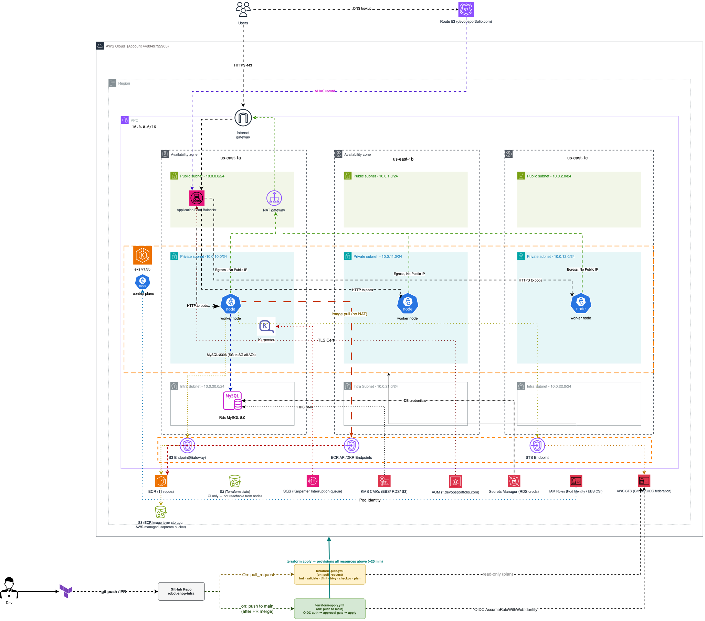

# robot-shop-infra

[](https://github.com/charliepoker/robot-shop-infra/actions/workflows/terraform-plan.yml)
[](https://github.com/charliepoker/robot-shop-infra/actions/workflows/terraform-apply.yml)
[](https://www.terraform.io/)
[](https://registry.terraform.io/providers/hashicorp/aws/latest)
[](LICENSE)

The AWS layer of a production-style EKS platform, built entirely with Terraform. It started as 10 modules for the network, cluster and database, and grew phase by phase to **17 modules**, as the platform on top of it needed DNS automation, certificates, secrets, backups, image verification and authenticated observability.

It runs the [Instana Robot Shop](https://github.com/instana/robot-shop) microservices app. The Kubernetes layer lives in [robot-shop-gitOps](https://github.com/charliepoker/robot-shop-gitOps), and the delivery pipeline in [robot-shop](https://github.com/charliepoker/robot-shop).

> **Status (Oct 2026):** built, applied and used through Phase 5. The environment is **torn down to control cost**, so `*.devopsportfolio.com` URLs are offline. Route 53, ACM, Cognito, IAM / GitHub OIDC, KMS, ECR and S3 are kept (about $4–5/month); everything else rebuilds from this repo. See [Known limitations](#known-limitations).

## The three repos

| Repo | Role |
|---|---|
| **robot-shop-infra** (this repo) | Terraform: VPC, EKS, RDS MySQL, ECR, Route 53, ACM, KMS, Secrets Manager, Cognito, Pod Identity roles, GitHub OIDC |
| [robot-shop-gitOps](https://github.com/charliepoker/robot-shop-gitOps) | Argo CD app-of-apps: platform tools, admission policy, observability, app manifests |
| [robot-shop](https://github.com/charliepoker/robot-shop) | App code and the CI/CD pipeline that signs images and bumps tags in the GitOps repo |

---

## Architecture


*Editable source: [`Docs/diagrams/aws_infra.drawio.svg`](Docs/diagrams/aws_infra.drawio.svg) (the SVG embeds the draw.io diagram; open it in draw.io to edit).*

**How to read it.** The numbers match the diagram.

1. **Ingress.** Internet → internet gateway → ALB in the public subnets (TLS from the ACM wildcard) → pod IPs on nodes in the private subnets → RDS in the intra subnets, reachable on 3306 only from the node security group.
2. **Control plane and auth.** The AWS-managed EKS control plane reaches the nodes through ENIs in the private subnets. Requests to `prometheus.` go through a Cognito login at the ALB first.
3. **Egress.** Private subnets → the single NAT gateway in AZ 1 → internet gateway. A deliberate cost trade-off (see [Key decisions](#key-decisions)).
4. **CI federation.** GitHub Actions presents its OIDC token, STS returns short-lived credentials, and the job pushes to ECR. No static AWS keys exist.
5. **Private AWS access.** ECR (api + dkr) and STS through interface endpoints in all three private subnets, and S3 through the free gateway endpoint, so image pulls never cross the NAT.
6. **Spot interruptions.** EventBridge rules → SQS → Karpenter drains and replaces the node before AWS reclaims it.
7. **Logging.** VPC flow logs (60 s aggregation) and five EKS control-plane log types (api, audit, authenticator, controllerManager, scheduler) → CloudWatch Logs.

The ALB itself is not in Terraform: the AWS Load Balancer Controller creates it from Kubernetes Ingresses at runtime. Terraform provides the subnets, tags and the controller's IAM role.

---

## How it got here

The infrastructure was not designed in one pass. Each phase of the project added what the next layer of the platform needed, and the commit history records why.

| Phase | When | What changed in AWS | Why |
|---|---|---|---|
| **1 · Foundation** (`v1.0.0`) | Jul 6–8 | S3 state backend; `kms`, `route53`, `vpc`, `eks`, `karpenter`, `rds-mysql`, `ecr`, `acm`, `secrets-manager`, `github-oidc` | A working cluster, database and registry with no static credentials |
| **2 · Platform** (`v2.0.0`) | Jul 15–19 | `aws-lb-controller`, `external-dns`, `cert-manager`, `external-secrets`, `velero` (S3 backup bucket); cluster-admin and KMS admins pinned to explicit principals | Each in-cluster controller needs its own least-privilege AWS role, delivered through EKS Pod Identity |
| **3 · App modernization** | Jul 24–29 | Per-service DB credentials for `ratings` and `shipping`; RDS switched to an **RDS-managed master password** | A `password_wo` + `random_password` setup drifted out of sync with the instance; letting RDS own the password removed the drift |
| **4 · DevSecOps** | Aug 27–30 | ECR moved to `IMMUTABLE_WITH_EXCLUSION` for Cosign `.sig`/`.att` tags; `kyverno` read-only ECR role | Signatures and attestations must be re-writable while app image tags stay immutable; Kyverno must read signatures from ECR to enforce them |
| **5 · Observability** | Sep 30–Oct 1 | `cognito` user pool; Grafana admin and Alertmanager Slack secrets | Prometheus has no login of its own, so the ALB authenticates against Cognito; observability credentials come from Secrets Manager, not from Git |

What Phase 1 looked like, before the platform phases: 


---

## Network design

| Tier | Subnets (one per AZ) | What lives there | Route out |
|---|---|---|---|
| **Public** | `10.0.0.0/24`, `10.0.1.0/24`, `10.0.2.0/24` | ALB, NAT gateway (AZ 1 only) | Internet gateway |
| **Private** | `10.0.10.0/24`, `10.0.11.0/24`, `10.0.12.0/24` | EKS nodes, interface endpoint ENIs | Single NAT gateway |
| **Intra** | `10.0.20.0/24`, `10.0.21.0/24`, `10.0.22.0/24` | RDS (DB subnet group spans all three) | **None** |

- VPC `10.0.0.0/16` across the first three available AZs in `us-east-1`, with DNS hostnames and support enabled (required for private DNS on the interface endpoints).
- **VPC endpoints:** S3 (gateway, free), ECR API, ECR DKR and STS (interface, in all three private subnets, security group allowing 443 from the VPC CIDR).
- **Flow logs** to CloudWatch Logs at 60-second aggregation.

---

## Modules

| Module | Added | What it provisions |
|---|---|---|
| `kms` | Phase 1 | 3 customer-managed keys (RDS, EBS, S3), rotation enabled |
| `route53` | Phase 1 | Public hosted zone for `devopsportfolio.com` |
| `vpc` | Phase 1 | 3-AZ VPC, 9 subnets, single NAT, VPC endpoints, flow logs |
| `eks` | Phase 1 | EKS 1.35; managed node group (t3.medium, AL2023, min 2 · max 5); public + private API endpoint; Secrets envelope-encrypted with the EBS key; access entries; add-ons `vpc-cni`, `coredns`, `kube-proxy`, `eks-pod-identity-agent`, `aws-ebs-csi-driver` |
| `karpenter` | Phase 1 | Node IAM role, Pod Identity association, SQS interruption queue, EventBridge rules (the Helm chart lives in the GitOps repo) |
| `rds-mysql` | Phase 1 | MySQL 8.0, `db.t4g.micro`, single-AZ, gp3 20 GB autoscaling to 100 GB, KMS-encrypted, RDS-managed master password |
| `ecr` | Phase 1 | 11 repositories, scan on push, `IMMUTABLE_WITH_EXCLUSION`, lifecycle policy, AES-256 |
| `acm` | Phase 1 | Wildcard certificate `*.devopsportfolio.com` + apex, DNS-validated |
| `secrets-manager` | Phase 1 | RDS connection secret; later per-service DB credentials, Grafana admin, Alertmanager Slack webhook |
| `github-oidc` | Phase 1 | GitHub OIDC provider and the app repo's ECR push/pull role |
| `aws-lb-controller` | Phase 2 | Pod Identity role for the AWS Load Balancer Controller |
| `external-dns` | Phase 2 | Pod Identity role for ExternalDNS (Route 53 records) |
| `cert-manager` | Phase 2 | Pod Identity role for cert-manager (DNS-01 via Route 53) |
| `external-secrets` | Phase 2 | Pod Identity role for External Secrets Operator |
| `velero` | Phase 2 | Backup S3 bucket + Pod Identity role |
| `kyverno` | Phase 4 | Read-only ECR Pod Identity role for image-signature verification |
| `cognito` | Phase 5 | User pool, client and domain for ALB authentication of Prometheus |

---

## Key decisions

Each is a trade-off between cost, complexity and production-readiness. Where the choice is cost-driven, the production alternative is noted.

| Decision | Rationale |
|---|---|
| **Single NAT gateway** | Saves about $65/month versus one per AZ. If AZ 1 fails, every AZ loses egress. Production: `one_nat_gateway_per_az = true`. |
| **VPC endpoints for ECR, STS and S3** | Image pulls and credential exchange stay on the AWS network and avoid NAT data-processing charges. |
| **RDS in intra subnets** | No route to the internet at all, so even a misconfigured security group cannot expose the database. |
| **Security-group-to-security-group rules** | RDS allows 3306 only from the node security group, which survives node IP changes. |
| **RDS-managed master password** | `manage_master_user_password = true`: RDS owns the password, so nothing can drift out of sync with the instance (the Phase 3 fix). |
| **`db.t4g.micro`, single-AZ, 1-day backups** | About $13/month and enough for this workload. Production: a larger class, Multi-AZ, longer retention. |
| **MongoDB and Redis in-cluster** | Managed equivalents would add roughly $30–50/month with no benefit at this scale. |
| **EKS Pod Identity, not IRSA** | The v21 module default. Every controller gets its own least-privilege role without service-account annotations. |
| **Access entries, not `aws-auth`** | The `aws-auth` ConfigMap is deprecated; access entries are a first-class AWS API. |
| **KMS CMKs for RDS, EBS, S3 and EKS Secrets** | Per-operation CloudTrail auditing and key-policy control that AWS-managed keys don't give. |
| **ECR immutable tags, one exclusion** | Application image tags can never be overwritten; only Cosign's `sha256-*.sig` / `.att` tags are re-writable for re-signing. |
| **Wildcard ACM certificate** | One DNS-validated certificate covers every hostname and renews automatically. |
| **GitHub OIDC federation** | No static AWS credentials in GitHub. The app repo's role trusts one repo and one branch. |
| **Cognito in front of Prometheus** | Prometheus has no authentication; the ALB enforces a Cognito login before forwarding. |
| **S3 native state locking** | `use_lockfile = true` (Terraform 1.11+) replaces the deprecated DynamoDB lock table. |

---

## CI/CD

**`terraform-plan.yml` on every pull request**
- `terraform fmt`, `terraform validate`, `tflint` (AWS ruleset)
- Trivy config scan (HIGH and CRITICAL fail the job) and Checkov (Terraform framework, configured to hard-fail on HIGH and CRITICAL)
- `terraform plan` and an Infracost breakdown, both posted as PR comments

**`terraform-apply.yml` on merge to `main`**, when `environments/**` or `modules/**` change
- The job runs in the `prod` GitHub environment and waits for approval
- A concurrency group prevents parallel applies against the same state
- `terraform apply -auto-approve` only skips Terraform's prompt; the plan is **recomputed at apply time**, so the approval gate is the human checkpoint
- Every third-party action is pinned to a commit SHA, tool downloads are checksum-verified, permissions are scoped per job, and zizmor reports no findings. Dependabot keeps the pins current.

Both workflows authenticate to AWS with GitHub OIDC; no long-lived credentials are stored in GitHub.

---

## Getting started

### Prerequisites

- AWS account with admin credentials (for the one-time bootstrap only)
- `aws-cli` >= 2.15, `terraform` >= 1.11, `kubectl` >= 1.35
- `pre-commit` >= 3.5 and `tflint` for local hooks
- A domain whose registrar points at the Route 53 nameservers

### One-time bootstrap

Three things exist outside this repo's Terraform:

1. **The state bucket**, because Terraform can't create the place it stores its own state.
2. **The pipeline's IAM roles** for plan and apply, trusted by the GitHub OIDC provider. They are created manually and not yet managed here.
3. **Repository secrets** `AWS_PLAN_ROLE_ARN`, `AWS_APPLY_ROLE_ARN` and `INFRACOST_API_KEY`. The ARNs are identifiers, not credentials.

```bash
# 1. State bucket
ACCOUNT_ID=$(aws sts get-caller-identity --query Account --output text)
BUCKET="robotshop-tf-state-${ACCOUNT_ID}"

aws s3api create-bucket --bucket "$BUCKET" --region us-east-1
aws s3api put-bucket-versioning --bucket "$BUCKET" \
  --versioning-configuration Status=Enabled
aws s3api put-bucket-encryption --bucket "$BUCKET" \
  --server-side-encryption-configuration \
  '{"Rules":[{"ApplyServerSideEncryptionByDefault":{"SSEAlgorithm":"AES256"}}]}'
aws s3api put-public-access-block --bucket "$BUCKET" \
  --public-access-block-configuration \
  BlockPublicAcls=true,IgnorePublicAcls=true,BlockPublicPolicy=true,RestrictPublicBuckets=true

# 2. Point backend.tf at your bucket (the committed value is the author's account ID)
sed -i.bak "s/448049792905/${ACCOUNT_ID}/" environments/prod/backend.tf && rm environments/prod/backend.tf.bak

# 3. Local hooks
pre-commit install
tflint --init --config=.tflint.hcl
```

### Deploy

```bash
cd environments/prod
terraform init
terraform plan -out=tfplan
terraform apply tfplan

aws eks update-kubeconfig --name robot-shop --region us-east-1
kubectl get nodes -o wide

# Point the registrar at these (first deploy only)
terraform output route53_name_servers
```

A full apply takes about 20 minutes; the EKS control plane is the slow step. Then install Argo CD and apply the root app from the [gitOps repo](https://github.com/charliepoker/robot-shop-gitOps#bootstrap-order). After the first apply, set the real Alertmanager Slack webhook in Secrets Manager (`robot-shop/alertmanager-slack`); Terraform creates it with a placeholder.

---

## Teardown

Cluster-created AWS resources are invisible to Terraform, and a plain destroy can hang on them or leave them billing.

**Before destroying**, in this order:

1. Turn off auto-sync and self-heal on the Argo CD root app, so it doesn't recreate what you delete.
2. Delete the Ingresses and wait until the ALB is gone (`aws elbv2 describe-load-balancers`).
3. Delete PVCs, or plan to sweep leftover `available` EBS volumes.
4. Delete the Karpenter NodePools and EC2NodeClasses **while the controller is still running**, and wait for the instances to disappear. Destroying the controller first leaves finalizers that hang the destroy.
5. Remove Kyverno's webhooks, so a dead admission webhook can't block deletes.
6. Set `recovery_window_in_days = 0` for the Terraform-managed secrets, otherwise the 30-day recovery window blocks recreating them on the next apply.

**Then the targeted destroy:**

```bash
make destroy-targeted
```

It removes EKS, Karpenter, RDS, the Secrets Manager secrets and the VPC. It **keeps** everything marked ● in the diagram: Route 53, ACM, Cognito, IAM / GitHub OIDC, KMS, ECR and S3, so the next apply needs no nameserver change, certificate re-validation, key recreation or image rebuild.

> Do not add `module.kms` to the targets. A destroyed KMS key enters a 7–30 day deletion window that collides with the next rebuild.

`make destroy` removes everything. Afterwards, sweep for leftovers: load balancers and target groups, `available` EBS volumes, network interfaces, Elastic IPs, VPC endpoints and CloudWatch log groups.

---

## Security posture

- **Every PR:** `tflint`, Trivy config scan (HIGH/CRITICAL fail the build) and Checkov.
- **Local hooks:** `detect-private-key` blocks accidental key commits.
- **Accepted findings** are listed in [`.trivyignore`](.trivyignore), each with a justification: endpoint and RDS security-group egress (private subnets, no internet route); the EKS public API endpoint (private endpoint also enabled, no bastion or VPN); and ECR mutability (a Trivy false positive on `IMMUTABLE_WITH_EXCLUSION`).
- **Secrets:** no secret values are stored in this repo or in GitHub; the RDS master password is owned by RDS.

---

## Cost

Estimated monthly cost with everything running:

| Component | Cost |
|---|---|
| EKS control plane | $73 |
| EKS worker nodes (2× t3.medium) | ~$60 |
| NAT gateway (single) | ~$32 + data |
| RDS db.t4g.micro | ~$13 |
| VPC interface endpoints (ECR ×2, STS) | ~$22 |
| EBS storage (gp3) | ~$8 |
| Route 53 hosted zone | $0.50 |
| Everything else (S3, KMS, ECR storage, Secrets, ACM) | ~$5 |
| **Total** | **~$213/month** |

**Resting cost after the targeted destroy is about $4–5/month**: three KMS keys (~$3), the hosted zone ($0.50) and about 2 GB of ECR storage (~$0.20). Cost Explorer confirmed this after the October teardown.

---

## Known limitations

- **One environment, one region, no DR.** Recovery is a rebuild from these repos.
- **Single NAT gateway** is a single point of failure for egress.
- **RDS is single-AZ with 1-day backup retention** and Performance Insights disabled.
- **The EKS API endpoint is public** (private also enabled), accepted for a portfolio project with no bastion.
- **The pipeline's IAM roles are manual** and not yet in Terraform.
- **Rebuild time is unmeasured.** The ~20 minute figure is `terraform apply` alone.

## License

MIT. See [`LICENSE`](LICENSE).